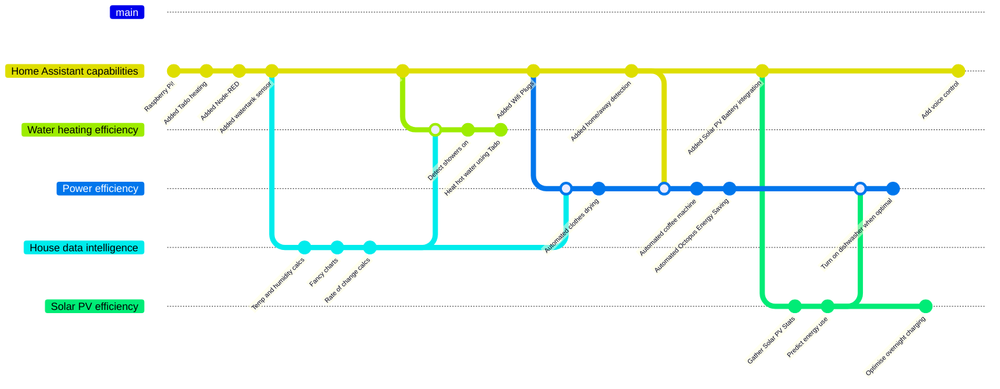

Not so long ago, the height of home automation was aspiring to a garage with a remote controlled door. Simpler times.

And then things got complex. Designer homes for the well-heeled, replete with extensive electronics to control lighting and home entertainment. Industrious individuals—*brave individuals*—would charge handsomly for installing these systems; taking on the risk when they inevitably didn't work quite as well as their client expected.

But happily these days, anyone with even the slightest of tech abilities can automate virtually every electronic device in their household.

If you've not tried it yet, I'd like to persuade you it's time to start.

# Why bother?

The wonderful thing about home automation is there's no single answer to the *"why"*. It's so phenomenally broad that there'll always be a topic that appeals to your unique motives. Pick that as your own starting point. A few ideas:

* Mood lighting that changes depending on what movie you're watching
* Coffee pot that switches on when you're nearly home
* Home heating that comes on earlier if it's cold outside
* Watering your houseplants when you're away on holiday

# Corporate clout

There's a good chance you've already started on home automation. Your favourite multinational corporation-tax specialists[^1] have sold more than 100 million Alexa units. Maybe there's one in front of you now. Congratulations, you've started on home automation!

Sort of.

While incredibly sophisticated, this approach to home automation is fundamentally built around corporate motivations. They're happy to integrate with your Spotify account and automate the music—but that's because there's money changing hands.

For most of the fun stuff, you'll want to break out of the corporate world. And it's *much* easier than it sounds.

# Home Assistant

This is a truly amazing piece of software. And it's free. Run [Home Assistant](https://www.home-assistant.io/) on a computer in your home and it'll let you combine your smart devices in powerful ways.

In many cases it will configure itself completely automatically. Here's a screenshot from my Home Assistant: entirely of its own accord it's discovered a Sony smart TV and a Brother laser printer (yes, an *actual printer*...)

# Dive in

If the scale of Home Assistant sounds intimidating: don't worry about exactly what you want to do, and give it a try. The first time you use it will probably be a throw-away attempt anyway, so use it to experiment.

The easiest way to install Home Assistant is on a [Raspberry Pi](https://www.raspberrypi.com/). Given you're interested enough to have read this far, then you're probably the kind of person who's got (or would enjoy) a Raspberry Pi to play with generally. I won't go through the install instructions here because the [Home Assistant Raspberry Pi guide](https://www.home-assistant.io/installation/raspberrypi) is pretty straightforward.

# Start small

Once it's up and running I really recommend adding the Node-RED add-on. This lets you create fully automated tasks, and takes just a few mouse clicks to set up. To install it go to Settings, Add-ons, click "Add-On Store", then Node-RED.

 For example if you've got WiFi plugs in the home, you could use Node-RED to automate "if I'm coming home, turn the coffee pot on." It's super easy: just drag a few things onto the Node-RED page and link them together:

That really is it. Home Assistant has figured out the hard bits, like how to tell you've come home, and how to control the WiFi plugs. I'll be honest there is a bit of "your mileage may vary": you'll need some WiFi plugs, for a start. Not to mention a coffee pot.

# A worked example

But start small, and just experiment with whatever Home Assistant has found in your house. So you might not have WiFi plugs; but maybe do a similar thing to turn your smart TV off when you leave the house? We'll work through an example.

### Step 1

1. Find the blue "zone" node from the panel on the left side, and drag it onto the page. Double-click it.
1. Set the "Entity" to be *person.(whatever your name is)*
1. Set the "Event" to be *Leave*
1. Set the "Zone" to be *zone.home*
1. Click *Done*

### Step 2

1. Find the blue "call service" node and drag it onto the page. Double-click it.
1. Set the "Domain" to be *remote* (meaning, remote control for a TV)
1. Set the "Service" to be *turn_off*
1. Set the "Entity" to be whatever your TV is called.
1. Click *Done*

### Step 3

1. Finally, drag a line between the two nodes to connect them together. Then click "Deploy". Done!

# Where next?

As you add more capabilities into Home Assistant, so you get more creative with it.

Because home automation is about combining things in interesting ways, your scope for creativity multiplies up with the number of devices.

With just 1 type of device to automate... Well, there's only 1 option. Increase that to 5, and—mathematicians, look away now—you've got *n!* = 120 ways to combine them!

My automation journey started with [Tado](https://tado.com) home heating control to optimise gas usage. From there, almost everything has been about carbon reduction. And I love it: real problem-solving and a tangible environmental benefit.

To show how home automation becomes a journey, increasing in creativity as you add more aspects, I'll leave you with a tube map representing my own journey. I started small on the left side, with the Tado heating. Then each time I added new capabilities, they've multiplied-up to become more creative and sophisticated along the way. I'll dive into these in more detail in later posts.

*(for any Git-nerds: you're right, I did use [Gitgraph/Mermaid](https://mermaid.js.org/syntax/gitgraph.html) for this diagram)*

[^1]: https://www.theguardian.com/technology/2021/sep/07/amazon-uk-arm-pays-38m-more-corporation-tax-despite-19bn-sales-rise