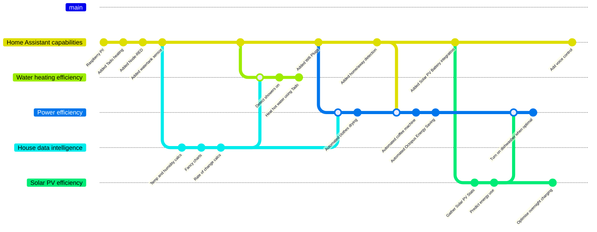

```mermaid
    gitGraph
        branch "Home Assistant capabilities"
        commit id: "Raspberry Pi!"
        commit id: "Added Tado heating"
        commit id: "Added Node-RED"
        commit id: "Added watertank sensor"

        branch "House data intelligence" order: 3
        commit id: "Temp and humidity calcs"
        commit id: "Fancy charts"
        commit id: "Rate of change calcs"

        checkout "Home Assistant capabilities"

        commit id: " "
        branch "Water heating efficiency" order: 1
        merge "House data intelligence"
        commit id: "Detect showers on"
        commit id: "Heat hot water using Tado"

        checkout "Home Assistant capabilities"
        commit id: "Added Wifi Plugs"

        branch "Power efficiency" order: 2
        merge "House data intelligence"
        commit id: "Automated clothes drying"

        checkout "Home Assistant capabilities"
        commit id: "Added home/away detection"

        checkout "Power efficiency"
        merge "Home Assistant capabilities"
        commit id: "Automated coffee machine"
        commit id: "Automated Octopus Energy Saving"

        checkout "Home Assistant capabilities"
        commit id: "Added Solar PV Battery integration"

        branch "Solar PV efficiency" order: 4
        commit id: "Gather Solar PV Stats"
        commit id: "Predict energy use"

        checkout "Power efficiency"
        merge "Solar PV efficiency"
        commit id: "Turn on dishwasher when optimal"

        checkout "Solar PV efficiency"
        commit id: "Optimise overnight charging"

        checkout "Home Assistant capabilities"
        commit id: "Add voice control"
```