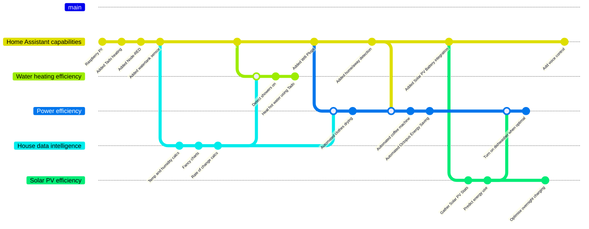

Not so long ago, the height of home automation was aspiring to a garage with a remote controlled door. Simpler times.

And then things got complex. Designer homes for the well-heeled, replete with extensive electronics to control lighting and home entertainment. Industrious individuals — *brave individuals* — would charge handsomly for installing these systems; taking on the risk when they inevitably didn't work quite as well as their client expected.

These days, anyone with even the slightest of tech abilities can automate virtually every electronic device in their household.

If you've not tried it yet, I'd like to persuade you it's time to start.

# Why bother?

The wonderful thing about home automation is there's no single answer to the *"why"*. It's so phenomenally broad that there'll always be a topic that appeals to your unique motives. Pick that as your own starting point. A few ideas:

* Mood lighting that changes depending on what movie you're watching
* Coffee pot that switches on when you're nearly home
* Home heating that comes on earlier if it's cold outside
* Watering your houseplants when you're away on holiday

# Start simple

